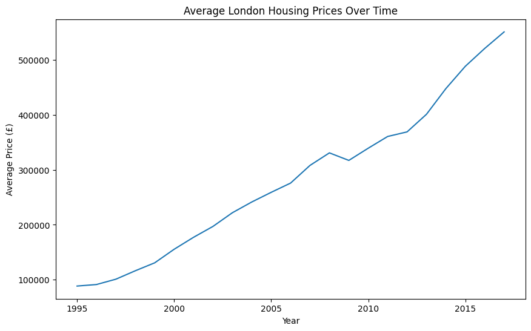

# London Housing Price Analysis

## Project Overview
This project analyses housing price trends across London using historical property price data.

The goal of the analysis is to identify how average housing prices in London have changed over time and highlight long term growth trends in the property market.

## Dataset
Dataset: Average House Prices by Borough  
Source: London Datastore (Greater London Authority)

The dataset contains yearly average housing prices derived from HM Land Registry transaction data.

## Tools Used
- Python
- Pandas
- Matplotlib
- Google Colab

## Data Cleaning
Several preprocessing steps were required before analysis:

- Extracted the numeric year from the original text-based year column
- Removed commas from price values
- Converted price data to numeric format
- Filtered the dataset to analyse mean house prices

## Analysis
The analysis calculates the average housing price across London boroughs for each year and visualises the long term trend in the London property market.

## Key Insights
- London housing prices have increased significantly since the mid-1990s.
- The largest growth occurred after 2012, where prices rose rapidly.
- Overall, the data shows a strong long-term upward trend in the London housing market.

## Visualisation

## Author
Parvez Hussain  
Mathematics Graduate 
